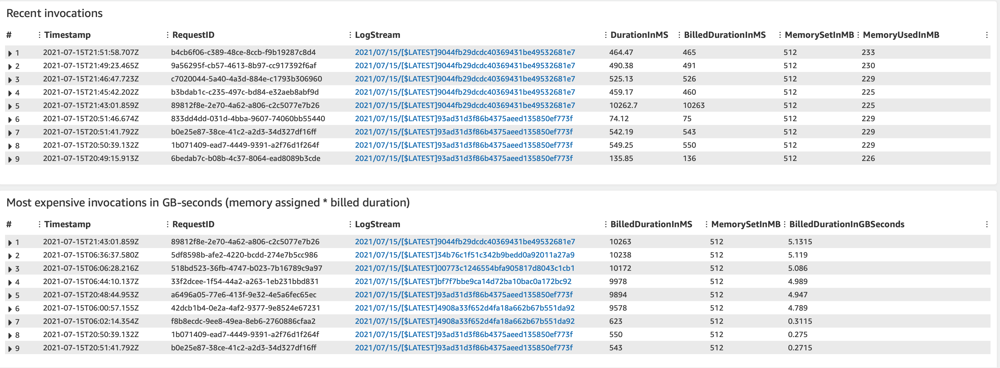

# AWS Lambda faster and cheaper with Java

- [Agenda](##agenda)
- [What are GraalVM and Quarkus?](##What-are-GraalVM-and-Quarkus?)
- [Setup development environment](##Setup-development-environment)
- [AWS Lambda Environment](##AWS-Lambda-Environment)
- [Native Linux Lambda function on AWS](##Native-Linux-Lambda-function-on-AWS)
- [The Java Project on AWS Lambda](##The-Java-Project-on-AWS-Lambda)
    - [Build native binary executable](###Build-native-binary-executable)
    - [Deploy built executable on AWS Lambda custom runtime](###Deploy-built-executable-on-AWS-Lambda-custom-runtime)
    - [Test this Lambda function on local machine](###Test-this-Lambda-function-on-local-machine)
    - [Invoke our native Lambda function](###Invoke-our-native-Lambda-function)
- [References](##References)

## Agenda
The AWS Lambda is a popular ecosystem for serverless development, and there are some important points that we should care of.
+ Cost of our serverless functions on AWS
+ Minimise the cold start and code initialization duration on AWS Lambda for each Lambda functions. [Predictable start-up times with Provisioned Concurrency](https://aws.amazon.com/blogs/compute/new-for-aws-lambda-predictable-start-up-times-with-provisioned-concurrency/)
  + 

+ 
+ 
+ 

## What are GraalVM and Quarkus?

GraalVM is a high-performance JDK distribution designed to accelerate the execution of applications written in Java and other JVM languages along with support for JavaScript, Ruby, Python, and a number of other popular languages.
One of the interesting features of GraalVM is converting any kind of Java application(s) to the native executable on Linux, Windows and macOS, and its native executable will be run faster and have less memory footprint.
On another hand, Quarkus is the supersonic framework on Java and it has been designed from scratch on top of GraalVM and Kubernetes native, and It is too much similar to the Spring framework and it will not take too much time to be onboarded for Spring Developers.

## Setup development environment

We should have GraalVM installed on our local machine and SDKMan will be very useful in this section, and we can still download it and install it like JDK.
+ Step 1: Install SDKMan
  Mac/Linux:

  ```curl -s "https://get.sdkman.io" | bash```

  for other OS please see this link https://sdkman.io/install

+ Step 2: Install GraalVM with SDKMan
  To see the list of JDK we can run this command

  ```sdk list java```

  and we can install GraalVM now

  ```sdk install java 21.2.0.r11-grl```

+ Optional Step:
  Install GraalVM directly without SDKMan and download GraalVM from this link GraalVM Community Edition 21.2.0
  So to confirm have successful installation we should be able to

  ```gu --version```

  It should be the GraalVM version like **GraalVM Updater 21.2.0**

+ Step 3: Install Native-Image
  We need to install native-image to be able to convert Java applications to native executable

  ```gu install native-image```

  and after that, we can get the native-image version

  ```native-image --version```

  and then we should see like GraalVM 21.2.0 Java 11 CE (Java Version 11.0.12+6-jvmci-21.2-b08)

## AWS Lambda Environment
Lambda has a couple different deployable environment.

|Runtime   |Amazon Linux   |Amazon Linux 2 (AL2)  |
|----------|:--------------|:---------------------|
|Node.js   |nodejs12.x     |nodejs10.x            |
|Python   |python3.7, python3.6 |python3.8        |
|Ruby     |ruby2.5         |ruby2.7               |
|Java     |java            |java11 (Corretto 11), java8.al2 (Corretto 8)   |
|Go       |go1.x           |	provided.al2      |
|.NET     |dotnetcore2.1   |dotnetcore3.1         |
|Custom   |provided       |provided.al2           |


## Native Linux Lambda function on AWS

Native Image is a technology to ahead-of-time compile Java code to a standalone executable, called a native image. This executable includes the application classes, classes from its dependencies, runtime library classes, and statically linked native code from JDK.
It does not run on the Java VM, but includes necessary components like memory management, thread scheduling, and so on from a different runtime system, called “Substrate VM”.
Managing the cost of AWS is super important, especially we are using AWS Lambda because we will be charged base on the performance of our applications for each request.
There are a couple of important numbers on AWS Lambda which help us to measure our application performance and AWS cloud cost.
Readme.md
+ Memory: We should assign an amount of memory to each Lambda Function like a normal application and more memory means more cost.
+ Initialize time: This time is meaning
+ Duration: TBD

## The Java Project on AWS Lambda
The target of the demo project is to show how to develop an application with Quarkus and deploy it on AWS Lambda as a native executable.
TBD

+ What This project is doing?
+ Debugging


### Build native binary executable
We can convert a Java application to native binary executable with GraalVM. Quarkus has an maven/gradle plugin to do this.

  ```
  $  mvn clean install -Pnative
  ```
If we are on different OS than Linux, we should use some params on Quakrus plugin to build an executable app compatible to Linux.

  ```
  $  mvn clean install -Pnative \
          -Dquarkus.native.container-build=true \
          -Dquarkus.native.builder-image=quay.io/quarkus/ubi-quarkus-native-image:21.2-java11
  ```

### Test this Lambda function on local machine
That's good we can test the function on our local machine before deploy it on AWS. It will reduce our time on development side.
First we should be able to run AWS services like SQS, SNS, DynamoDB, etc. on local machine.
Fortunately, AWS is providing docker images for existing services, and we can run them and connect them to our function(s).

+ DynamoDB: Initialize DynamoDB by Docker
```
$  docker run --publish 8000:8000 amazon/dynamodb-local:1.11.477 -jar DynamoDBLocal.jar -inMemory -sharedDb
```
This starts a DynamoDB instance that is accessible on port 8000. You can check it’s running by accessing the web shell on ```http://localhost:8000/shell```.

Have a look at the Setting Up DynamoDB Local guide for other options to run DynamoDB.

Open [http://localhost:8000/shell](http://localhost:8000/shell) in your browser. Then copy and paste the following code to the shell and run it:

```
var params = {
TableName: 'QuarkusFruits',
KeySchema: [{ AttributeName: 'fruitName', KeyType: 'HASH' }],
AttributeDefinitions: [{  AttributeName: 'fruitName', AttributeType: 'S', }],
ProvisionedThroughput: { ReadCapacityUnits: 1, WriteCapacityUnits: 1, }
};

dynamodb.createTable(params, function(err, data) {
if (err) ppJson(err);
else ppJson(data);

});
```

```
sam local invoke --template target/sam.jvm.yaml -d 5858 --event payload.json
```

```
aws dynamodb put-item --endpoint-url http://localhost:8000 --table-name QuarkusFruits \
  --item '{"fruitName": {"S": "Apple"}}' 
```

```
aws dynamodb get-item --endpoint-url http://10.0.0.44:8000 --table-name QuarkusFruits --key '{"fruitName": {"S": "Apple"}}'
```

+ SQS:

```
$  docker run --rm --name local-sqs -p 8010:4576 -e SERVICES=sqs -e START_WEB=0 -d localstack/localstack:0.11.1
```

+ SNS:

```
$  docker run -it --publish 8009:4575 -e SERVICES=sns -e START_WEB=0 localstack/localstack:0.11.1
```

### Deploy built executable on AWS Lambda custom runtime
Quarkus will produce two sam templates for us, one is for JVM base Lambda and second is for native executable.

+ JVM version
```
$ sam deploy -t target/sam.jvm.yaml -g
```

+ Native version
```
$ sam deploy -t target/sam.native.yaml -g
```

### Invoke our native Lambda function
We can invoke our Lambda function after having successful deployment on AWS

## References
+ SDKMan: https://sdkman.io
+ GraalVM: https://www.graalvm.org
+ GraalVM NativeImage: https://www.graalvm.org/reference-manual/native-image/
+ Quarkus: https://quarkus.io
+ An article of running Java app on Lambda: https://bmccann.medium.com/is-quarkus-the-magic-bullet-for-java-and-aws-lambda-567a0968a971