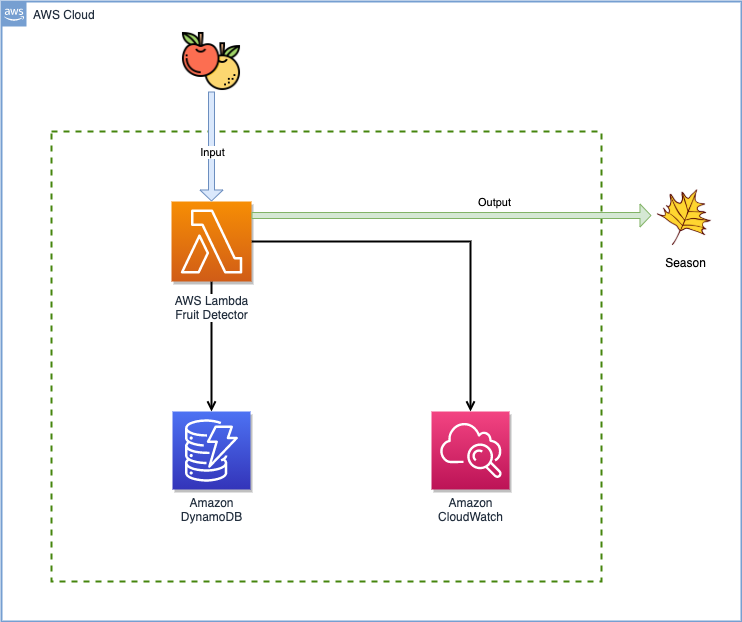
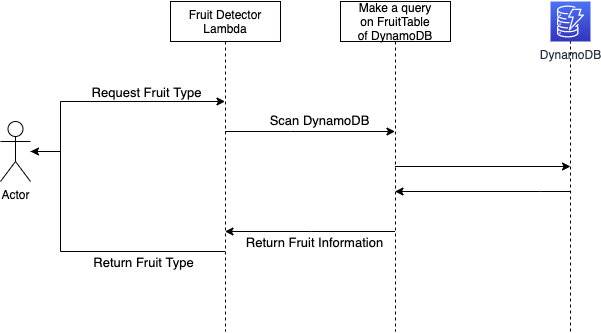
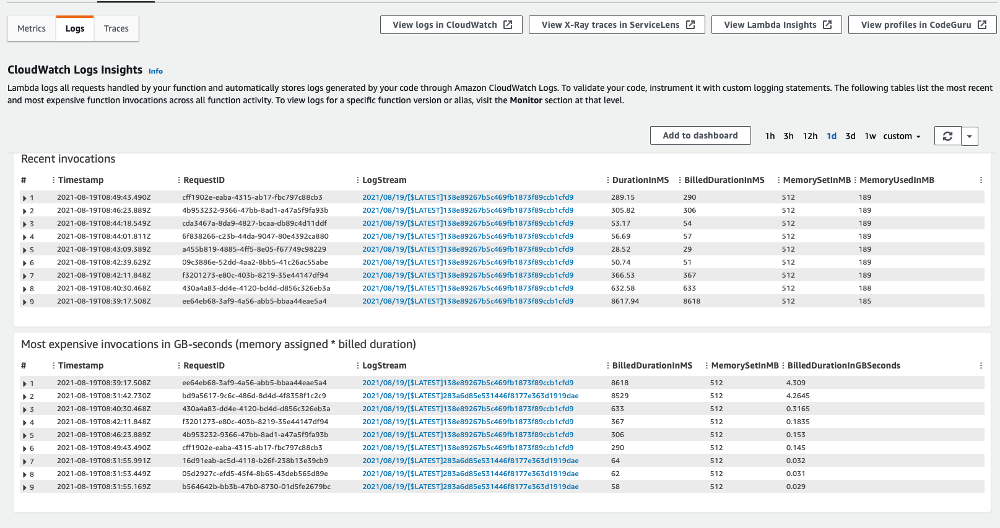
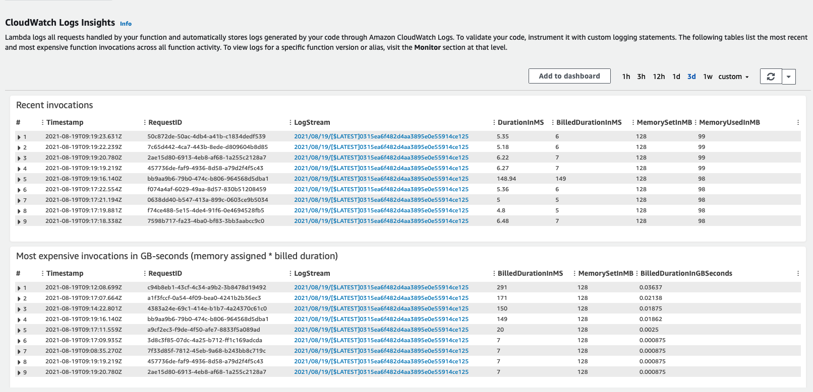
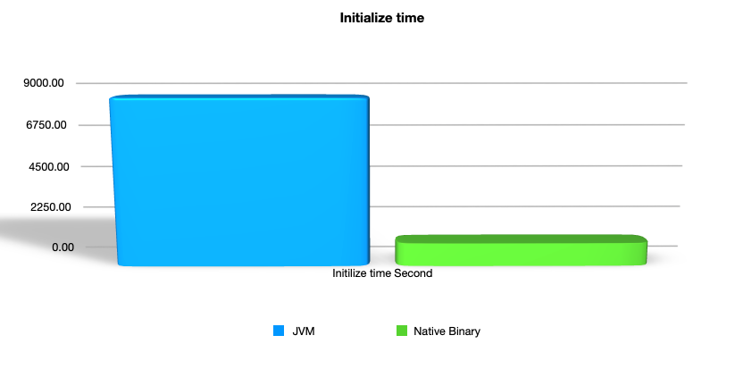
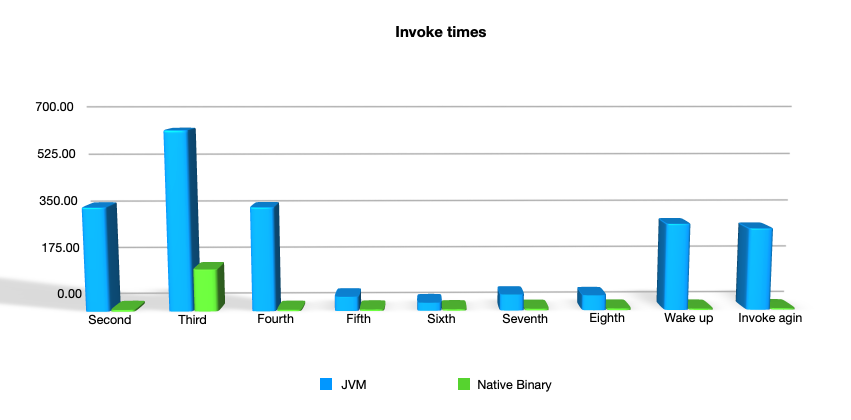

# Faster and cheaper on AWS Lambda with Java

- [Agenda](##Agenda)
- [The demo application](##The-demo-application)
    - [How does the demo application work?](###How-does-the-demo-application-work?)
    - [How can we create a Quarkus base Java application?](###How-can-we-create-a-Quarkus-base-Java-application?)
    - [What does Quarkus do to write a simple Java Application on AWS Lambda?](###What-does-Quarkus-do-to-write-a–simple-Java-Application-on-AWS-Lambda?)
    - [Deploy the demo application to AWS Lambda](###Deploy-the-demo-application-to-AWS-Lambda)
    - [Watching performance of the demo application on AWS Lambda + JVM platform](###Watching-of-the-demo-application-on-AWS-Lambda-+-JVM-platform)
- [What solution do we have for the AWS Lambda cold-start?](##What-solution-do-we-have-for-the-AWS-Lambda-cold-start?)
- [What is GraalVM?](##What-is-GraalVM?)
- [Build a native binary executable from the Java application](##Build-a-native-binary-executable-from-the-Java-application)
    - [AWS Lambda Environment](###AWS-Lambda-Environment)
    - [Deploy built binary executable on AWS Lambda](###Deploy-built-binary-executable-on-AWS-Lambda)
    - [Watching performance of the demo application on AWS Lambda + Custom platform](###Watching-performance-of-the-demo-application-on-AWS-Lambda-+-Custom-platform)
- [Analyzing the performance numbers of JVM & Native Binary on AWS Lambda](##Analyzing-the-performance-numbers-of-JVM-&-Native-Binary-on-AWS-Lambda)
- [Conclusion](##Conclusion)
- [References](##References)

## Agenda

The AWS Lambda is a popular platform for serverless development, and as a Java developer, I like to be able to use this
platform, but there are some essential points that we should take care of

+ Cost of serverless functions would be expensive on the JVM platform of AWS Lambda.
+ The Cold start on AWS Lambda can be a real issue on the JVM platform of AWS Lambda.
+ Maximize Efficiency in AWS Lambda for each request is a matter that can not be very well with the JVM Platform.

I am going to show how to address them by Java on this demo application.

There are two primary purposes of this article.

- How to use AWS service, e.g. DynamoDB by Quarkus framework.
- Having the best performance on AWS Lambda and make a minimum cost.

## The demo application

This repository contains an example of a Java application developed by JDK 11 & [Quarkus](https://quarkus.io), which is a
simple AWS Lambda function. This simple function will accept a fruit name in a JSON format(input) and return a type
of fruit.

```json
{
  "name": "Apple"
}
```

The type of fruit will be.

+ **Spring** Season Fruit
+ **Summer** Season Fruit
+ **Fall** Season Fruit
+ **Winter** Season Fruit

<br/>



<br/>

### How does the demo application work?

This demo is a simple Java application, and it will fetch the requested Fruit information, extract the type of fruit, and return it. How simple is that?!!
<br/>



<br/>

### How can we create a Quarkus base Java application?

Quarkus has a lovely guideline to use, and the AWS Lambda project is not an exception; please follow this one
on [Quarkus website](https://quarkus.io/guides/amazon-lambda). In a nutshell, we can create it with a Maven command.

```shell
mvn archetype:generate \
       -DarchetypeGroupId=com.thinksky \
       -DarchetypeArtifactId=aws-lambda-handler-qaurkus \
       -DarchetypeVersion=2.1.3.Final 
```

It will generate an application using AWS Java SDK.
The Quarkus framework has extensions for DynamoDB, S3, SNS and
SQS and more, and I would like to use AWS Java SDK V2. So the project pom file needs to have some modification, and please follow [this guideline](https://quarkus.io/guides/amazon-lambda#aws-sdk-v2) to update it.

The project has Lambda, a dependency inside of the pom file.

```xml

<dependency>
    <groupId>io.quarkus</groupId>
    <artifactId>quarkus-amazon-lambda</artifactId>
</dependency>
```

And I need to add a dependency to use AWS DynamoDB to be able to connect to DynamoDB.

```xml

<dependencies>

    <dependency>
        <groupId>io.quarkus</groupId>
        <artifactId>quarkus-amazon-dynamodb</artifactId>
    </dependency>

    <dependency>
        <groupId>io.quarkus</groupId>
        <artifactId>quarkus-apache-httpclient</artifactId>
    </dependency>

    <dependency>
        <groupId>software.amazon.awssdk</groupId>
        <artifactId>apache-client</artifactId>
        <exclusions>
            <exclusion>
                <artifactId>commons-logging</artifactId>
                <groupId>commons-logging</groupId>
            </exclusion>
        </exclusions>
    </dependency>

</dependencies>
```

I will use apache client on the setting of the application and need to add `apache-client`.

```properties
quarkus.dynamodb.sync-client.type=apache
```

### What does Quarkus do to write a simple Java Application on AWS Lambda?

A regular AWS Lambda Java project will be a simple Java project, but Quarkus will bring Dependency Injection inside a Java project.

```java

@ApplicationScoped
public class FruitService extends AbstractService {

    @Inject
    DynamoDbClient dynamoDB;

    public List<Fruit> findAll() {
        return dynamoDB.scanPaginator(scanRequest()).items().stream()
                .map(Fruit::from)
                .collect(Collectors.toList());
    }

    public List<Fruit> add(Fruit fruit) {
        dynamoDB.putItem(putRequest(fruit));
        return findAll();
    }

}
```

`DynamoDbClient` is a class from AWS Java SDK.v2, and Quarkus will build it and make it available in its Dependency
Injection ecosystem. The [FruitService](src/main/java/com/thinksy/service/FruitService.java) is inherited from an
abstract class [AbstractService](src/main/java/com/thinksy/service/AbstractService.java) and this abstract class will
provide basic objects of `DynamoDbClient` needs, e.g. `ScanRequest`, `PutItemRequest`, etc.

Reflection is using in Java frameworks, but it will be a new challenge on GraalVM native-image; please find out more information on [reflection in Graalvm](https://www.graalvm.org/reference-manual/native-image/Reflection/)
The second benefit of Quarkus is `@RegisterForReflection` annotation on classes, the easiest way to register a class for reflection in GraalVM.

```java
@RegisterForReflection
public class Fruit {

    private String name;
    private Season type;

    public Fruit() {
    }

    public Fruit(String name, Season type) {
        this.name = name;
        this.type = type;
    }
}
``` 

+ **point**: Quarkus makes much more benefits on using the AWS Lambda platform, and I will describe them in the following articles
  e.g. having multiple rest endpoints in one AWS Lambda and fit it with API-Gateway.

### Deploy the demo application to AWS Lambda

It's deployment time on AWS, and it will be super easy with Maven and Quarkus framework. But we should have some
preparation on AWS before deploy and run our application.

**1)** Define table of Fruits_TBL in DynamoDB

```shell
$ aws dynamodb create-table --table-name Fruits_TBL \
                          --attribute-definitions AttributeName=fruitName,AttributeType=S \
                          AttributeName=fruitType,AttributeType=S \
                          --key-schema AttributeName=fruitName,KeyType=HASH \
                          AttributeName=fruitType,KeyType=RANGE \
                          --provisioned-throughput ReadCapacityUnits=1,WriteCapacityUnits=1
```

Then insert some items of fruits on the table.

```shell
$ aws dynamodb put-item --table-name Fruits_TBL \
        --item file://item.json \
        --return-consumed-capacity TOTAL \
        --return-item-collection-metrics SIZE
```

the content of item.json

```json
{
  "fruitName": {
    "S": "Apple"
  },
  "fruitType": {
    "S": "Fall"
  }
}
```

Query from Dynamodb to make sure we have items.

```shell
$ aws dynamodb query \
     --table-name  Fruits_TBL \ 
     --key-condition-expression "fruitName = :name" \
     --expression-attribute-values '{":name":{"S":"Watermelon"}}'
```

**2)** Define a role in IAM to have access to DynamoBD and assign it to our Lambda application.

```shell
$ aws iam create-role --role-name fruits_service_role --assume-role-policy-document file://policy.json
```

and this is json policy.json

```json
{
  "Version": "2012-10-17",
  "Statement": {
    "Effect": "Allow",
    "Principal": {
      "Service": [
        "dynamodb.amazonaws.com",
        "lambda.amazonaws.com"
      ]
    },
    "Action": "sts:AssumeRole"
  }
}
```

and then assign the DynamoDB permission to this role

```shell
$ aws iam attach-role-policy --role-name fruits_service_role --policy-arn "arn:aws:iam::aws:policy/AmazonDynamoDBFullAccess"

$ aws iam attach-role-policy --role-name fruits_service_role --policy-arn "arn:aws:iam::aws:policy/service-role/AWSLambdaBasicExecutionRole"
```

and might be this permission as well

```shell
$ aws iam attach-role-policy --role-name fruits_service_role --policy-arn "arn:aws:iam::aws:policy/AWSLambda_FullAccess"
```

AWS platform is ready to deploy our application now.

```shell
$  mvn clean install
```

Quarkus framework will take care of creating a JAR artifact file and zip this JAR file,
and [SAM template](https://docs.aws.amazon.com/serverless-application-model/latest/developerguide/sam-specification.html)
of AWS for us, and we can deploy it by sam CLI now. We should use the JVM version this time, and I would like to add minor modifications.

2) Add a defined role to Lambda to have proper access

```yaml
  Role: arn:aws:iam::{Your-Account-Number-On-AWS}:role/fruits_service_role
```

3) Increase timeout

```yaml
  Timeout: 120
```

So SAM template is ready to deploy on AWS Lambda now.

```shell
$  sam deploy -t target/sam.jvm.yaml -g
```

This command will upload the jar file as a zip format to AWS and deploy it as Lambda Function. The next step will be to test it by invoking a request.


<br/>

### Watching performance of the demo application on AWS Lambda + JVM platform

It's time to run the deployed Lambda function, test it, and see how it performs well.

````shell
$ aws lambda invoke response.txt --cli-binary-format raw-in-base64-out --function-name {"FUNCTION_NAME":fruitApp} --payload file://payload.json --log-type Tail --query LogResult --output text | base64 --decode
````

FUNCTION_NAME will be figuring out with this simple command

```shell
$ aws lambda list-functions --query 'Functions[?starts_with(FunctionName, `fruitAppJVM`) == `true`].FunctionName'
```

_fruitAppJVM_ is the name of Lambda I gave to SAM CLI in the deployment process.

Then we can go to the AWS web console to see the result of invoking the function.



Numbers are talking, and it is a terrifying performance for a simple application. Why?! mostly it's because of AWS Lambda
cold-start features.

#### What is an AWS Lambda cold start?

When running a Lambda function, it stays active as long as you’re running it. It means that your container stays alive and ready for execution. AWS will drop the container after a period of inactivity (will be too short), and your
function becomes inactive or cold. A cold start occurs when a request comes to the idle lambda function; then, will be initialized the
application to be able to the server to the request (initialize mode of Java framework).  
On the other hand, a worm start happens when there are available lambda
containers, [for more information see](https://aws.amazon.com/blogs/compute/operating-lambda-performance-optimization-part-1/)

<br/>
So the cold start is most the main reason we have this terrifying performance, because each time the cold start occurs, AWS will be initialized our Java application, it's obvious, will take a long time for each request. 

## What solution do we have for the AWS Lambda cold-start?

There are two approaches to this fundamental issue.

+ Using Provisioned Concurrency It's not the scope of this article, and please
  visit [Predictable start-up times with Provisioned Concurrency](https://aws.amazon.com/blogs/compute/new-for-aws-lambda-predictable-start-up-times-with-provisioned-concurrency/)
+ Having better performance on initialize time and response time of the Java application. The main question is how do we can make better performance in our Java application? My answer is to create a native binary executable from our Java application and deploy it on AWS Lambda. [Oracle GraalVM](https://graalvm.org) possible.

## What is GraalVM?

GraalVM is a high-performance JDK distribution designed to accelerate the execution of applications written in **Java**
and other JVM languages along with support for **JavaScript**, **Ruby**, **Python**, and a number of other popular
languages. Native Image is a technology to ahead-of-time compile Java code to a standalone executable, called a native
image. This executable includes the application classes, classes from its dependencies, runtime library classes, and
statically linked native code from JDK. It does not run on the Java VM, but includes necessary components like memory
management, thread scheduling, and so on from a different runtime system, called “Substrate VM”.

## Build a native binary executable from the Java application

We need to install GraalVM and its Native-Image
from [this guideline](https://thinksky.com/blog/2021/07/20/install-graalvm-native-image/) first. After install
GraalVM, we can convert a Java application to a native binary executable with GraalVM. Quarkus makes it easy for us, and
it has a Maven/Gradle plugin for it, so in a typical Quarkus based application, we will have a profile called native.

```shell
$  mvn clean install -Pnative
```

Maven will build a native binary executable file, and it will be executable base on your local machine if you are on.
Windows, this file will be only runnable on Windows machines. But AWS Lambda will deploy on AWS Linux(v1 or v2). This binary file should be runnable on Linux. In this case, the Quarkus framework will cover this requirement by a simple parameter on its plugin.

```shell
$  mvn clean install -Pnative \
        -Dquarkus.native.container-build=true \
        -Dquarkus.native.builder-image=quay.io/quarkus/ubi-quarkus-native-image:21.2-java11
```

As mention on the command _**-Dquarkus.native.builder-image**_, we can specify what version of GraalVm we want to use to
create a native binary file.

### AWS Lambda Environment

AWS Lambda has a couple of different deployable environments.

|Runtime   |Amazon Linux   |Amazon Linux 2 (AL2)  |
|----------|:--------------|:---------------------|
|Node.js   |nodejs12.x     |nodejs10.x            |
|Python   |python3.7, python3.6 |python3.8        |
|Ruby     |ruby2.5         |ruby2.7               |
|Java     |java            |java11 (Corretto 11), java8.al2 (Corretto 8)   |
|Go       |go1.x           |    provided.al2      |
|.NET     |dotnetcore2.1   |dotnetcore3.1         |
|Custom   |provided       |provided.al2           |

So previously deployed the Java Application on Lambda on java11 (Corretto 11), and it doesn't have good performance.
We have two options for the pure Linux platform on Lambda now, which are **_provided_** and **_provided.al2_**.

- point: **provided** will use Amazon Linux and **provided.al2** will
  use  [Amazon Linux 2](https://aws.amazon.com/amazon-linux-2/faqs/), so because of long-term support of version 2, I
  I would like to suggest use version 2.

### Deploy built binary executable on AWS Lambda

As we saw, Quarkus will produce two sam templates for us; one is for JVM base Lambda and the second one is the native binary
executable. We should use a native one this time, and I would like to have some slight modifications on it as well.

1) Change to AWS Linux V2

```yaml
  Runtime: provided.al2
```

2) Add the defined role to Lambda to have proper access

```yaml
  Role: arn:aws:iam::{Your-Account-Number-On-AWS}:role/fruits_service_role
```

3) Increase timeout

```yaml
  Timeout: 30
```

The final version of the native SAM template will be like this [file](final.sam.native.yaml); it is ready to deploy on AWS.

```
$ sam deploy -t target/sam.native.yaml -g
```

This command will upload the binary file as a zip format to AWS and deploy it as Lambda Function exactly like the JVM version,
and now we can jump to the exciting part of monitoring performance.

### Watching performance of the demo application on AWS Lambda + Custom platform

It's time to run the deployed Lambda function, test it, and see how it performs well.

````shell
$ aws lambda invoke response.txt --cli-binary-format raw-in-base64-out --function-name {"FUNCTION_NAME":fruitApp} --payload file://payload.json --log-type Tail --query LogResult --output text | base64 --decode
````

FUNCTION_NAME will be figured out with this simple command

```shell
$ aws lambda list-functions --query 'Functions[?starts_with(FunctionName, `fruitAppNative`) == `true`].FunctionName'
```

_fruitAppNative_ is the name of Lambda I gave to SAM CLI in the deployment process.

Then we can go to the AWS web console to see the result of invoking the function.


Wow, what great numbers are showing up.

## Analyzing the performance numbers of JVM & Native Binary on AWS Lambda

We can analyze and compare both versions of the application on the AWS Lambda platform, and it can be comparable in two
categories.

+ **Initialize time**
  The first call or invoke of the Lambda function is Initialize time, and it will be almost the most extended duration of
  invoking an application because our Java application will start from scratch in this phase.

  
  It is a super big difference between JVM and Binary version, and it means an initial time of the native binary version almost is **_8 times_** faster than the JVM version.

<br/>

+ **Invoke times**
  I invoke the Lambda function nine times after initialized step, and this is the performance result.
  
  As we see the result, there is a significant difference in the performance between the JVM version and Native.
  Binary.

<br/>

## Conclusion

Quarkus framework will help us have clear and structured code on Java application by having some good features like Dependency.
Injection, as well, will help us to convert our Java application to a native-binary file with getting the help of
GraalVM.
The native binary version has a significantly better performance than the JVM version.
- The binary uses just **128 MB** of ram, and the JVM version uses **512 MB** of ram, which it means has saved money on AWS Lambda costs.
- AWS Lambda will charge us based on the duration of usage of the Lambda function, which means better performance will make less cost.

## References

+ [GraalVM](https://www.graalvm.org)
+ [GraalVM NativeImage](https://www.graalvm.org/reference-manual/native-image/)
+ [GraalVM Native Image Support in the AWS SDK for Java 2.x](https://aws.amazon.com/blogs/developer/graalvm-native-image-support-in-the-aws-sdk-for-java-2-x/)
+ [Quarkus](https://quarkus.io)
+ [QUARKUS - AMAZON LAMBDA](https://quarkus.io/guides/amazon-lambda)
+ [Optimize your Java application for AWS Lambda with Quarkus](https://aws.amazon.com/blogs/architecture/field-notes-optimize-your-java-application-for-aws-lambda-with-quarkus/)
+ [An article of running Java app on Lambda](https://bmccann.medium.com/is-quarkus-the-magic-bullet-for-java-and-aws-lambda-567a0968a971)